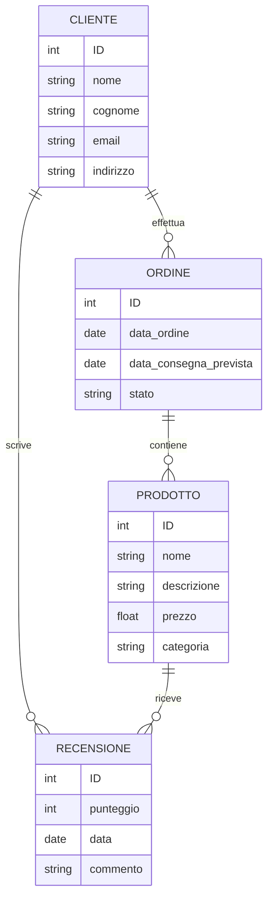
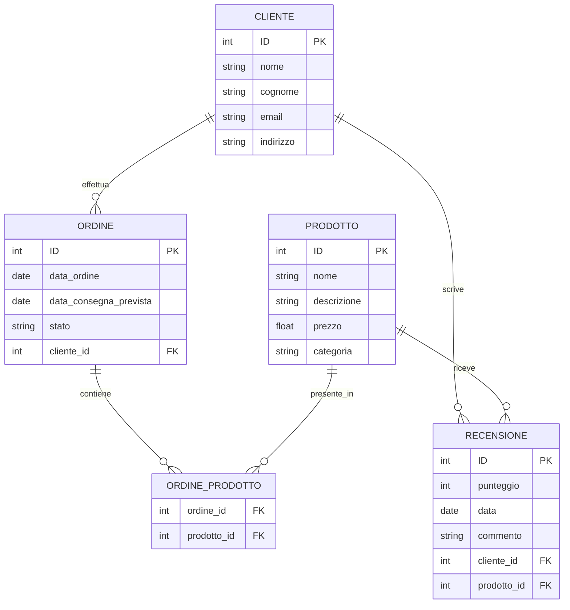

### Progettazione Concettuale

```mermaid
erDiagram
    PRODOTTO {
        int ID
        string nome
        string descrizione
        float prezzo
        string categoria
    }
    CLIENTE {
        int ID
        string nome
        string cognome
        string email
        string indirizzo
    }
    ORDINE {
        int ID
        date data_ordine
        date data_consegna_prevista
        string stato
    }
    RECENSIONE {
        int ID
        int punteggio
        date data
        string commento
    }
    CLIENTE ||--o{ ORDINE : effettua
    ORDINE ||--o{ PRODOTTO : contiene
    CLIENTE ||--o{ RECENSIONE : scrive
    PRODOTTO ||--o{ RECENSIONE : riceve
```

### Progettazione Logica

```mermaid
erDiagram
    PRODOTTO {
        int ID PK
        string nome
        string descrizione
        float prezzo
        string categoria
    }
    CLIENTE {
        int ID PK
        string nome
        string cognome
        string email
        string indirizzo
    }
    ORDINE {
        int ID PK
        date data_ordine
        date data_consegna_prevista
        string stato
        int cliente_id FK
    }
    RECENSIONE {
        int ID PK
        int punteggio
        date data
        string commento
        int cliente_id FK
        int prodotto_id FK
    }
    ORDINE_PRODOTTO {
        int ordine_id FK
        int prodotto_id FK
    }
    CLIENTE ||--o{ ORDINE : effettua
    ORDINE ||--o{ ORDINE_PRODOTTO : contiene
    PRODOTTO ||--o{ ORDINE_PRODOTTO : presente_in
    CLIENTE ||--o{ RECENSIONE : scrive
    PRODOTTO ||--o{ RECENSIONE : riceve
```
